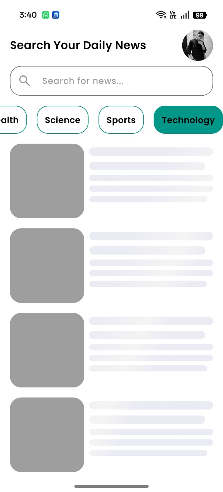

# 📰 News App

A Flutter news application that displays real-time news from APIs with a clean and user-friendly interface.

---

## 🚀 Getting Started

This project is a Flutter application that fetches and displays news articles from REST APIs.

It focuses on performance, clean UI, and smooth user experience.

---

## 📸 Screenshots

### Main Screens

  <table>
    <tr>
      <td></td>
      <td></td>
      <td></td>
      <td></td>
    </tr>
  </table>

---

## 🛠 Features

- Display news from REST API  
- Category-based filtering  
- News details screen  
- Search functionality  
- Error handling & loading states  
- Clean UI  

---

## 🛠 Technologies

- Flutter & Dart  
- REST APIs  
- Cubit (State Management)  
- Clean Architecture  

---

## 📂 Project Structure

- Presentation Layer (UI & Cubit)  
- Data Layer (API & Models)  
- Clean and scalable structure  

---

## 👨‍💻 Author

Ahmed Mohamed Esmail  
Flutter Developer
